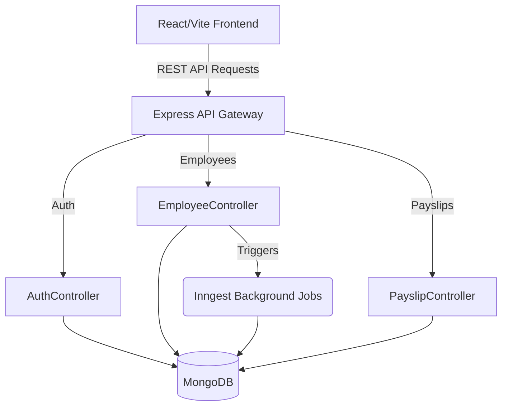
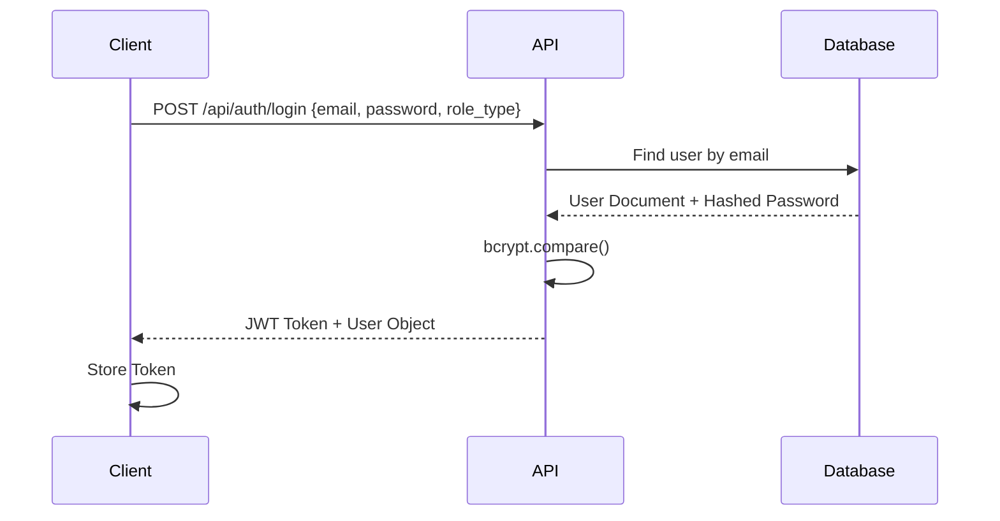
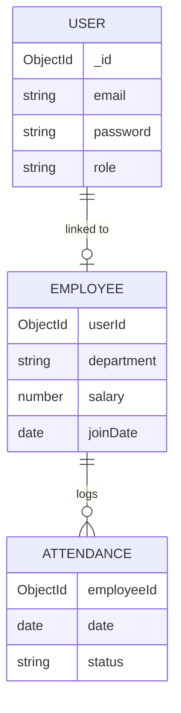

<div align="center">

# Employee Management System (EMS)

A full-stack HR platform for streamlining workforce operations — automated attendance tracking, leave management, and dynamic payslip generation, secured with role-based access control.


<br />

[Live Demo]() · [Documentation](#overview) · [Report Bug](https://github.com/Sakshya10027/ems-platform/issues) · [Request Feature](https://github.com/Sakshya10027/ems-platform/issues)

</div>

**Current Version:** 1.0.0
**Project Status:** Development / Production-Ready

---

## Overview

**What the project does:**
EMS centralizes core HR operations — attendance, leave, and payroll — into a single platform with distinct, secure portals for Admins and Employees.

**Why it was built & Problem it solves:**
Manual spreadsheets and disconnected tools lead to missed attendance logs, slow leave approvals, and payroll errors. EMS replaces that chaos with an automated, role-based system that gives small-to-medium businesses professional-grade HR tooling without enterprise software costs.

**Target users:**
Small-to-medium businesses, HR administrators, and employees who need a lightweight, self-hostable workforce management platform.

**Key capabilities:**
- One-click attendance check-in/check-out with daily logging.
- Admin-driven leave approval workflow.
- Instant, downloadable payslip generation with net salary calculation.
- Background cron jobs for automated reminders and attendance checks.

---

## Features

### Access & Security
- **Role-Based Access Control:** Dedicated, secure portals for Admins and Employees with restricted data boundaries.
- **JWT Authentication:** Stateless, secure session handling with `bcrypt` password hashing.

### Attendance & Leave
- **Automated Attendance Tracking:** One-click check-ins/check-outs with dynamic UI updates.
- **Leave Management System:** Employees submit requests; Admins approve or reject through a dedicated workflow.

### Payroll
- **Dynamic Payslip Generation:** Instantly calculates net salaries and generates organized, downloadable payslips.

### Automation & UI
- **Background Cron Jobs:** Automated reminders and attendance checks powered by Inngest.
- **Modern, Responsive UI:** Premium, intuitive interface built with React and Tailwind CSS.

---

## Tech Stack

### Frontend
| Technology | Purpose |
|------------|---------|
| React (Vite) | Fast, modern UI component rendering |
| Tailwind CSS | Utility-first styling for a responsive, clean design |
| Axios | HTTP client for API communication |

### Backend
| Technology | Purpose |
|------------|---------|
| Node.js | JavaScript runtime |
| Express.js | RESTful API framework |
| Mongoose | MongoDB ODM / schema modeling |
| JSON Web Token | Stateless authentication |
| bcrypt | Password hashing |

### External Tools & Services
| Service | Purpose |
|---------|---------|
| Inngest | Reliable background jobs and scheduled cron tasks |
| MongoDB Atlas | Cloud database |

---

## Project Architecture

The application uses a **Client-Server Architecture** separating the React frontend from the Node.js Express backend.



- **Client:** Handles presentation, auth session state (`AuthContext`), and routing.
- **Server:** Exposes RESTful endpoints, manages JWT auth, runs Inngest background jobs, and enforces role-based route protection.

---

## Folder Structure

```
ems-platform/
│
├── Client/
│   ├── public/
│   ├── src/
│   │   ├── api/              # Axios interceptors and configurations
│   │   ├── components/       # Reusable UI components (Modals, Forms)
│   │   ├── context/          # AuthContext.jsx
│   │   ├── pages/            # Page views (Dashboard, Settings)
│   │   ├── App.jsx           # Main router and layout wrapper
│   │   └── main.jsx          # React DOM entry
│   └── package.json
│
├── server/
│   ├── controllers/          # authController, employeeController, payslipController
│   ├── inngest/               # Background jobs and cron tasks
│   ├── middleware/           # protect.js, protectAdmin.js
│   ├── models/                # User.js, Employee.js, Attendance.js
│   ├── routes/                # Express API routers
│   ├── server.js              # Main Express entry point
│   └── package.json
│
└── README.md
```

---

## Folder Explanation

| Folder | Purpose |
|--------|---------|
| `Client/src/api` | Axios instance and interceptors for API communication. |
| `Client/src/components` | Reusable React components like Modals and Forms. |
| `Client/src/context` | Global auth session state management. |
| `Client/src/pages` | Full-page container components representing routes. |
| `server/controllers` | Business logic for handling API requests and sending responses. |
| `server/models` | Mongoose schemas defining User, Employee, and Attendance collections. |
| `server/routes` | Express router definitions mapping URLs to controller functions. |
| `server/middleware` | Route protection logic for authenticated and admin-only routes. |
| `server/inngest` | Background/scheduled tasks (reminders, attendance checks). |

---

## File Explanation

- **`server.js`**: Backend entry point. Sets up Express, CORS, connects to MongoDB, and registers routes.
- **`main.jsx`**: Frontend entry point that mounts the React app.
- **`App.jsx`**: Root router and layout wrapper for all pages.
- **`AuthContext.jsx`**: Manages the authenticated user's session state across the client.
- **`protect.js` / `protectAdmin.js`**: Middleware that verifies JWT validity and restricts admin-only routes.
- **`inngest/`**: Contains scheduled function definitions for reminders and automated attendance checks.

---

## Prerequisites

- **Node.js**: v18.x or higher
- **npm** or **yarn**
- **MongoDB**: Local instance or Atlas Cloud URI

---

## Installation Guide

**1. Clone repository**
```bash
git clone https://github.com/Sakshya10027/ems-platform.git
cd ems-platform
```

**2. Setup Server**
```bash
cd server
npm install
```

**3. Setup Client**
Open a new terminal window:
```bash
cd Client
npm install
```

---

## Environment Variables

### Backend (`server/.env`)
| Variable | Required | Description | Example |
|----------|----------|-------------|---------|
| `MONGODB_URI` | Yes | MongoDB connection string | `mongodb://localhost:27017/ems` |
| `JWT_SECRET` | Yes | Secret string for hashing tokens | `your_super_secret_jwt_key` |
| `PORT` | No | Server port (default 4000) | `4000` |
| `ADMIN_EMAIL` | Yes | Admin email for initial database seeding | `admin@example.com` |

### Frontend (`Client/.env`)
| Variable | Required | Description | Example |
|----------|----------|-------------|---------|
| `VITE_BASE_URL` | No | Target API URL | `http://localhost:4000` |

---

## Running the Project

**Development Mode**
- Backend: `cd server && npm run server` (hot-reloading).
- Frontend: `cd Client && npm run dev` (hot-reloading).

The frontend runs at `http://localhost:5173` and the backend API at `http://localhost:4000`.

**Production Mode**
- Backend: `npm start` (runs `node server.js`).
- Frontend: `npm run build` (outputs to `dist/`), serve using Vercel, Netlify, or a static host.

---

## Application Workflow

**Authentication Flow**


**Payslip Generation Flow**
1. Admin selects an employee and pay period.
2. `payslipController` fetches employee salary structure and attendance records.
3. Net salary is calculated from base pay, deductions, and attendance data.
4. A payslip record is saved and returned as downloadable data.

---

## API Documentation

| Method | Endpoint | Description | Auth Required |
|--------|----------|-------------|---------------|
| POST | `/api/auth/login` | Authenticates user and returns JWT | No |
| GET | `/api/employees` | Fetches all active employees | Yes (Admin) |
| POST | `/api/payslips` | Generates a new payslip | Yes (Admin) |
| PUT | `/api/profile` | Updates the authenticated user's profile | Yes |

**Example Request: `POST /api/auth/login`**
```json
{
  "email": "admin@example.com",
  "password": "admin123",
  "role_type": "admin"
}
```

**Example Response: `200 OK`**
```json
{
  "user": {
    "userId": "64abcdef1234567890",
    "role": "ADMIN",
    "email": "admin@example.com"
  },
  "token": "eyJhbGciOiJIUzI1NiIsInR..."
}
```

---

## Database

**Database Type:** NoSQL (MongoDB)

**Collections:**
1. **User**: Stores credentials, role, and profile details.
2. **Employee**: Stores employee records linked to a user account (department, salary structure, join date).
3. **Attendance**: Stores daily check-in/check-out logs per employee.



---

## Configuration

- **Vite (`vite.config.js`)**: Configures the React plugin and dev server proxy.
- **Tailwind (`tailwind.config.js`)**: Utility-first styling configuration.
- **Inngest**: Registers scheduled functions for reminders and attendance automation.

---

## Build Instructions

**Frontend Production Build:**
```bash
cd Client
npm run build
```
Generates optimized static files in the `dist/` directory.

---

## Deployment

**Frontend Deployment (Vercel / Netlify)**
1. Connect GitHub repo.
2. Set Build Command to `npm run build`.
3. Set the `VITE_BASE_URL` environment variable to your deployed backend URL.

**Backend Deployment (Render / Railway)**
1. Connect GitHub repo to a Node.js web service.
2. Set root directory to `server/`.
3. Add environment variables (`MONGODB_URI`, `JWT_SECRET`, etc.) using a production MongoDB Atlas URI.
4. Start command: `node server.js`.

---

## Testing

*Currently, the project uses manual testing. Automated testing (Jest/Vitest) is planned for a future release.*

---

## Logging

- The application uses `console.log` and `console.error` for basic standard output logging.
- Inngest background jobs log execution status for reminders and attendance checks.

---

## Error Handling

- **Validation:** Basic validation implemented inside Express controllers (checking for empty fields, invalid credentials).
- **Exceptions:** Global try-catch blocks in async route handlers ensure the server does not crash on unhandled promises.
- **HTTP Errors:** Appropriate status codes (400 Bad Request, 401 Unauthorized, 404 Not Found, 500 Server Error) returned cleanly as JSON.

---

## Security

- **Authentication:** Token-based security using JSON Web Tokens (JWT).
- **Password Protection:** Passwords are never stored in plain text — hashed using `bcrypt`.
- **Route Protection:** `protect.js` and `protectAdmin.js` middleware ensure sensitive routes are inaccessible without a valid Bearer token and correct role.
- **CORS:** Cross-Origin Resource Sharing enabled to allow frontend requests.

---

## Performance Optimizations

- **Background Job Offloading:** Inngest handles scheduled/recurring tasks outside the main request-response cycle.
- **Database Indexing:** Indexes on `userId` and `employeeId` fields ensure fast lookups.

---

## Troubleshooting

- **`Port 4000 already in use`**: Another service is running. Change `PORT` in `.env` and update `VITE_BASE_URL` accordingly.
- **`MongoDB connection failed`**: Ensure your IP address is whitelisted in your MongoDB Atlas Network Access tab.
- **Login fails with valid credentials**: Confirm `JWT_SECRET` matches between deployments and that the correct `role_type` is being sent.

---

## Available Scripts

| Command | Location | Purpose |
|---------|----------|---------|
| `npm run dev` | `Client/` | Start Vite dev server |
| `npm run build` | `Client/` | Build production frontend |
| `npm start` | `server/` | Run Node server (Production) |
| `npm run server` | `server/` | Run Node server with Nodemon (Dev) |

---

## Coding Standards

- **Formatting:** Prettier / ESLint standards.
- **Naming Conventions:** camelCase for variables/functions, PascalCase for React Components and Mongoose Models.

---

## Contributing

1. Fork the Project
2. Create your Feature Branch (`git checkout -b feature/AmazingFeature`)
3. Commit your Changes (`git commit -m 'Add some AmazingFeature'`)
4. Push to the Branch (`git push origin feature/AmazingFeature`)
5. Open a Pull Request

---

## Roadmap

- [ ] Implement automated testing (Unit and E2E).
- [ ] Add CSV export for Attendance and Payslips.
- [ ] Build an analytics dashboard with charts for HR metrics.
- [ ] Integrate a third-party email provider (e.g., Resend) for real notifications.
- [ ] Improve mobile-responsive design for the employee portal.

---

## Known Limitations

- **No automated testing suite** currently in place.
- **Email notifications** are not yet integrated — reminders are logged, not emailed.

---

## License

This project is licensed under the MIT License - see the [LICENSE.md](LICENSE.md) file for details.

---

## Author

- **Author Name:** Sakshya Patel
- **GitHub:** https://github.com/Sakshya10027
- **LinkedIn:** https://www.linkedin.com/in/sakshya-patel-20751232a/
- **Portfolio:** https://animated-portfolio-tau-nine.vercel.app/

---

## Acknowledgements

- Built with [React](https://react.dev/)
- Background jobs powered by [Inngest](https://www.inngest.com/)
- Toast Notifications by [React Hot Toast](https://react-hot-toast.com/)
